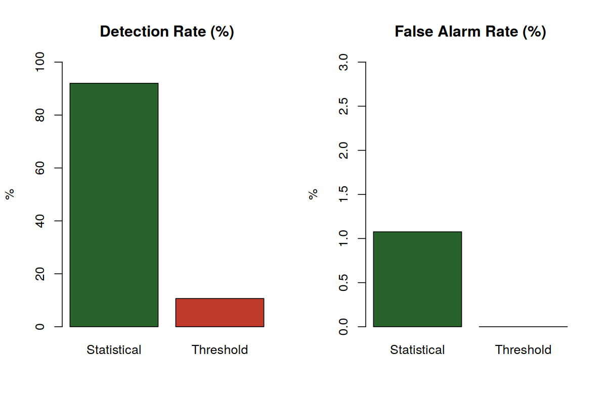

# GPU Thermal Anomaly Detection

Detecting overheating episodes in simulated GPU telemetry by comparing a **naive fixed-threshold alert** against a **statistical alert** built from Maximum Likelihood Estimation (MLE) and a one-sided hypothesis test - evaluated against known ground truth.


---

## Overview

Thermal data are constantly generated by GPUs, and perhaps the most straightforward method to detect potential overheating is a fixed threshold test, which triggers an alarm if the observed data point exceeds the specified boundary value. This approach is easily interpretable, yet it is blind to the nature of the observations below the threshold level, as it considers all the values below the threshold as good enough without discrimination.

The purpose of this research is to find out if there exists any improvement in the accuracy of overheating detection using the statistical method, where the algorithm first estimates the distribution of the reference dataset and raises an alarm on the abnormal data points. For this purpose, we utilize a synthetically generated dataset, where all the data points have ground-truth labels.

| | |
|---|---|
| **Language** | R (base + `optim`) |
| **Data** | Simulated, 10,000 GPU temperature readings, seeded (`set.seed(3)`) for exact reproducibility |
| **Approach** | MLE-fitted Gaussian normal-operating model + one-sided upper-tail hypothesis test, vs. a fixed 90°C threshold |
| **Evaluation** | Confusion matrix (TP/FN/TN/FP), Detection Rate, False Alarm Rate, against known injected anomaly episodes |

## Key Results

| Metric | Statistical Alert | Threshold Alert |
|---|---:|---:|
| True Positives (TP) | 138 | 16 |
| False Negatives (FN) | 12 | 134 |
| True Negatives (TN) | 9,744 | 9,850 |
| False Positives (FP) | 106 | 0 |
| **Detection Rate** | **92.0%** | 10.7% |
| **False Alarm Rate** | 1.08% | **0.0%** |

The statistical alert catches **92% of true anomalies** at a small (1.08%) false-alarm cost. The fixed threshold never raises a false alarm, but only catches the extreme tip of each anomaly episode - the 16 points across all five episodes that literally cross 90°C - missing the other 134 points that are well outside normal range but still under the absolute cutoff.




## How It Works

1. **Simulate telemetry** (`simulate_data.R`) - 9,850 "normal" readings ~ N(67°C, 1°C), plus 150 readings forming five 30-point ramp-up/ramp-down anomaly episodes (peaking ~90–93.5°C), spliced into the sequence at fixed, known positions. Saves `Data/telemetry_data.csv` (combined) and `Data/normal_data.csv` (normal-only reference sample).
2. **Fit the normal-operating distribution** (`analysis.R`) - estimate Normal(μ, σ) parameters from the reference sample via Maximum Likelihood, minimizing the negative log-likelihood with `optim()`.
3. **Score every reading** - compute a z-score against the fitted distribution and its one-sided upper-tail p-value.
4. **Flag statistical alerts** - p < α = 0.01 (significant at the 1% level).
5. **Evaluate** - compare both the statistical alert and the fixed 90°C threshold against the known anomaly-episode ground truth using a confusion matrix.

## Repository Structure

```
gpu-anomaly-detection/
├── README.md
├── src/
    ├── simulate_data.R          # generates the synthetic telemetry + reference data
    ├── analysis.R                # MLE fit, hypothesis test, evaluation
├── Data/
│   ├── telemetry_data.csv    # 10,000 readings (combined normal + anomalies)
│   └── normal_data.csv       # 9,850 normal-only reference readings
├── Plots/
│   ├── fig1_timeseries.png
│   ├── fig2_histogram.png
│   └── fig5_comparison.png
├── report/
│   └── Project_Report.pdf    # 4-page project report
└── LICENSE
```


## License

Released under the [MIT License](LICENSE).

## Author

**AMIT** — [amit.learning.email@gmail.com] — [linkedin](https://linkedin.com/in/amit1527)
